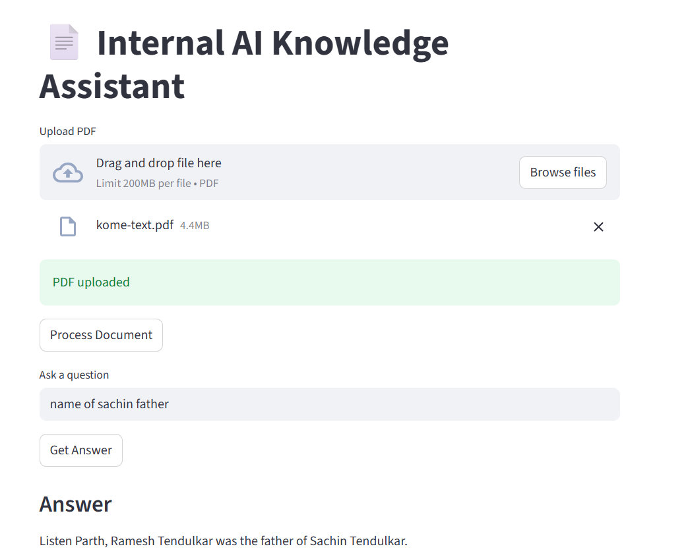
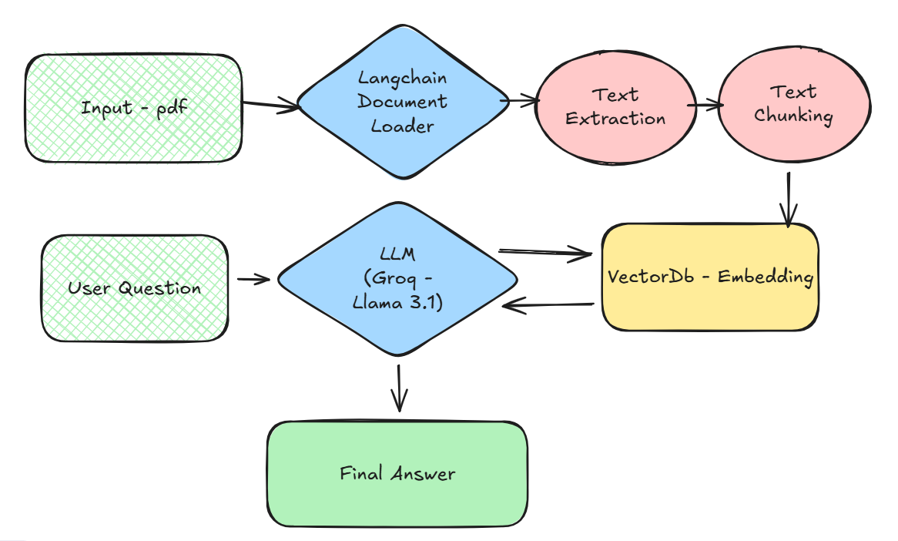

📘 Internal AI Knowledge Assistant
RAG-based Document Question Answering System

An AI-powered internal knowledge assistant built using Retrieval-Augmented Generation (RAG).
Users can upload documents and ask questions that are answered strictly from the document content, ensuring zero hallucination.

🚀 Features

📄 Upload text-based PDF documents

✂️ Automatic text extraction and chunking

🧠 Semantic search using vector embeddings

🔎 Retrieval-Augmented Generation (RAG) pipeline

🤖 Fast LLM inference using Groq (Llama 3.1)

🚫 Hallucination control with strict prompting

💬 Clean and interactive Streamlit UI

🧩 System Architecture

The application follows a standard RAG (Retrieval-Augmented Generation) workflow:

PDF documents are loaded and processed

Text is split into overlapping chunks

Chunks are converted into vector embeddings

Embeddings are stored in a vector database

User queries retrieve relevant chunks

The LLM generates answers only from retrieved context

📌 Refer to the architecture diagram included in this repository.

🛠️ Tech Stack

Language: Python

UI: Streamlit

Framework: LangChain

Vector Database: ChromaDB

Embeddings: FastEmbed

LLM: Groq (Llama 3.1)

Environment Management: python-dotenv

📂 Project Structure
internal-ai-assistant/
│
├── app.py            # Streamlit UI (entry point)
├── ingest.py         # PDF ingestion & embedding
├── rag.py            # Retrieval + LLM logic
├── requirements.txt  # Dependencies
├── .gitignore        # Ignored files
├── architecture.png  # System architecture
└── README.md

⚙️ How to Run the Project Locally
1️⃣ Clone the Repository
git clone https://github.com/your-username/internal-ai-assistant.git
cd internal-ai-assistant

2️⃣ Create & Activate Virtual Environment
python -m venv venv

Windows

venv\Scripts\activate

Mac / Linux

source venv/bin/activate

3️⃣ Install Dependencies
pip install -r requirements.txt

4️⃣ Configure Environment Variables

Create a .env file in the project root:

GROQ_API_KEY=your_groq_api_key_here

⚠️ Never commit .env to GitHub.

5️⃣ Run the Application
streamlit run app.py

## 🖥️ Application Output

Below are sample outputs from the application demonstrating document-based
question answering.

### 🔹 Document-Based Question Answering

## 🧩 System Architecture

The following diagram illustrates the overall architecture of the application,
showing how documents are ingested, processed, embedded, and queried using a
Retrieval-Augmented Generation (RAG) pipeline.

6️⃣ Use the Application

Upload a text-based PDF

Click Process Document

Ask questions related to the document

🧠 Hallucination Control

The assistant is designed to:

✅ Answer only when information exists in the document

❌ Reject out-of-context questions with:

"I don't have enough information."

This makes the system suitable for enterprise and internal use cases.

🔐 Security & Best Practices

API keys stored using environment variables

Sensitive files excluded via .gitignore

Vector DB & temp files not committed

GitHub Push Protection prevents secret leaks

📌 Example Use Cases

Internal company knowledge assistant

Policy / report Q&A system

Educational document analysis

Secure document-based chatbots

🏆 Learning Outcomes

End-to-end RAG pipeline implementation

Hands-on vector database usage

Secure API key handling

Prompt engineering for factual accuracy

Production-style GenAI project setup

📜 License

This project is intended for educational and portfolio purposes.

👨‍💻 Author

Parth
GenAI & AI Enthusiast
